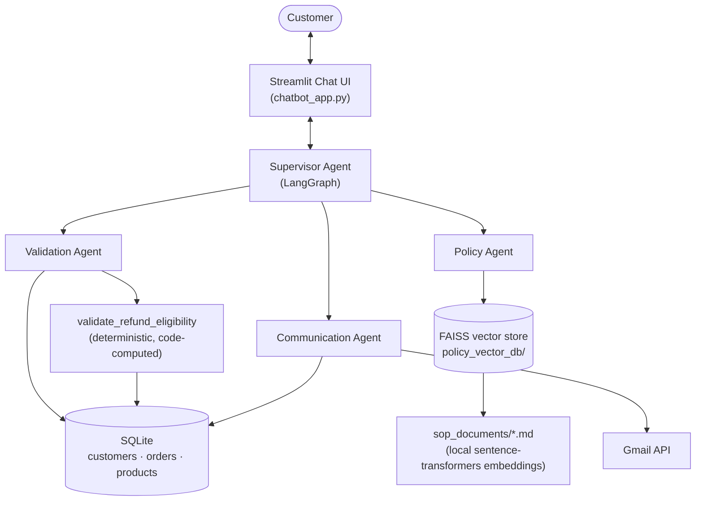

# Refund & Return Processing — Multi-Agent AI System

A multi-agent customer service system that handles refund and return requests end-to-end: it verifies the customer and order against a database, checks return-window eligibility and duplicate-refund history deterministically (not by LLM guesswork), searches a policy knowledge base to calculate the refund amount, and emails the customer with the decision — all orchestrated through a LangGraph supervisor and surfaced in a Streamlit chat UI that streams each agent's reasoning live.

Built to run entirely on free-tier infrastructure: [Groq](https://console.groq.com/) for LLM inference and local HuggingFace sentence-transformers for embeddings — no OpenAI key required.

## Why this exists

Most refund-bot demos either hardcode a rules engine or let an LLM freewheel the whole decision. This project deliberately splits the two: **eligibility (return window, duplicate refunds) is a hard, code-computed gate** that no agent can override, while the LLM agents handle everything that genuinely benefits from language understanding — reading the customer's issue, searching policy documents, calculating amounts, and writing the email. That split was learned the hard way: an earlier version let the LLM reason about return-window eligibility from raw dates in conversation, and it approved a refund for an order 541 days past its 45-day window. See [CLAUDE.md](CLAUDE.md) for the full incident writeup and the three separate fixes it took.

## Architecture



## Features

- **Multi-agent orchestration** — a LangGraph supervisor delegates to specialized validation, policy, and communication agents, each with its own narrow toolset.
- **Deterministic eligibility gate** — return-window and duplicate-refund checks run in code against the database, not LLM inference, and the supervisor treats the verdict as non-overridable.
- **RAG-based policy search** — return eligibility, refund calculation, customer-tier benefits, and exception-handling policies are chunked and semantically searched from markdown SOP documents via a local FAISS index.
- **Live agent trace in the UI** — the Streamlit app streams each agent's delegation, tool calls, and intermediate reasoning as it happens, instead of a single blocking spinner.
- **Order picker, not free text** — when the agent looks up a customer's orders, the UI renders a selectable table (order date, product, category, status) instead of asking the customer to retype an order ID.
- **Self-refreshing demo data** — a synthetic order generator keeps order/delivery dates relative to *today* so the return-window logic stays testable indefinitely, with a daily GitHub Actions job wired up for a git-backed deploy target.
- **Free-tier only** — Groq for chat completion, local sentence-transformers for embeddings, SQLite for storage.

## Tech stack

| Layer | Choice |
|---|---|
| Agent orchestration | LangGraph, `langgraph-supervisor` |
| LLM | Groq (`llama-3.3-70b-versatile`) |
| Embeddings / RAG | `sentence-transformers` (local) + FAISS |
| Data | SQLite via SQLAlchemy |
| UI | Streamlit |
| Dependency management | `uv` |
| Testing | `pytest` |
| Deployment | Docker, Streamlit Community Cloud, GitHub Actions (scheduled data refresh) |

## Quickstart

```sh
uv sync                                    # or: pip install -r requirements.txt
cp .env.example .env                       # add a free Groq key: https://console.groq.com/keys
python database_creation.py                # seed the database from data/*.csv
python -m src.vector_db_creation           # build the policy vector index (already committed, but rebuild if sop_documents/ changes)
streamlit run chatbot_app.py
```

Full setup detail (Gmail integration, synthetic data generation, testing, Docker, deployment) is in [CLAUDE.md](CLAUDE.md).

## Testing

```sh
uv run pytest
```

Tests run against an isolated temp SQLite database and focus on the eligibility logic and synthetic data generator — see [CLAUDE.md](CLAUDE.md#testing).

## Project structure

```
chatbot_app.py              Streamlit chat UI
database_creation.py        SQLAlchemy models + CSV seeding
src/
  agents.py                 Supervisor + validation/policy/communication agents
  db_tools.py                Customer/order/product lookup + eligibility tools
  vector_db_creation.py      Policy document chunking + FAISS index build
  vector_db_tools.py         Policy search tools
  email_tools.py             Gmail notification tools
  model.py                   Groq chat model config
scripts/
  generate_daily_orders.py   Synthetic order generator (keeps demo data fresh)
data/                        Seed CSVs (customers, products, orders)
sop_documents/                Policy markdown source for the vector store
tests/                       pytest suite
.github/workflows/           Scheduled synthetic-data refresh
```

## License

No license file yet — all rights reserved by default. Add one (MIT is a common choice for portfolio projects) if you want others to reuse this code.
